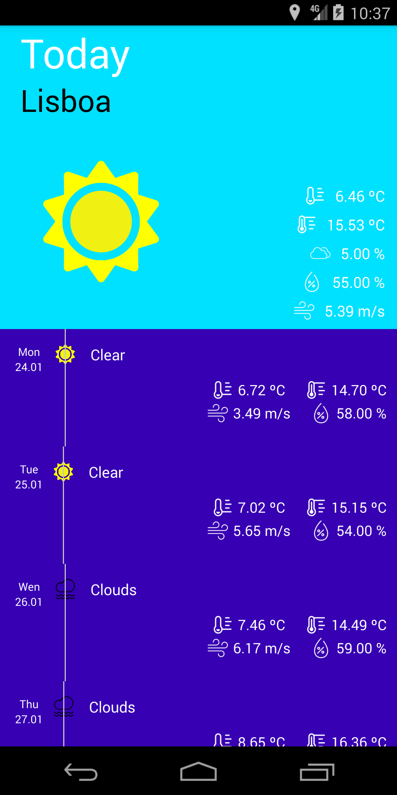

# Open Weather
<!---Esses são exemplos. Veja https://shields.io para outras pessoas ou para personalizar este conjunto de escudos. Você pode querer incluir dependências, status do projeto e informações de licença aqui--->


> [Open Weather](https://openweathermap.org/) data consuming application.




> This project is still under development

### Project boundaries

- Min SDK: 19(Kit Kat)

### Main tools used in development

- Dagger 2
- Room DB
- Retrofit
- Expresso

## 🚀 Building and installing

- First you need to [Sign up](https://home.openweathermap.org/users/sign_up) in Open Weather platform in order to provide an API key to get access to data, you can follow [this](https://openweathermap.org/api) guide

Windows:
- Copy the api key in platform, click on start on Windows, type "System" in the search and click in System option
- Now Click on Advanced system options on the right panel
- Click on "Enviroment variables"
- On the first panel of the new opened window, click in new.
- In the name of the variable put OPEN_WEATHER_API_TOKEN
- In the value of the variable paste your api key got from open weather website
- Click in OK in all the opened windows in order to save the changes
- Restart your PC

- Clone this project wherever you want
```
git clone git@github.com:joaogouveia89/open-weather.git
```

- Open the project in Android Studio, in the top menu, click in Run, and then in Run app


## 📝 License

This project is under license. See [LICENSE](LICENSE.md) for details.